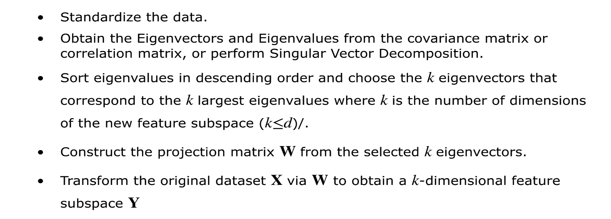

#

Principal Component Analysis (PCA) is a simple dimensionality reduction technique
It can capture linear correlations between the features. 

For a given (standardized) data, PCA can be calculated by eigenvalue decomposition of covariance (or correlation) matrix of the data, or Singular Value Decomposition (SVD) of the data matrix. 

https://setosa.io/ev/principal-component-analysis/

